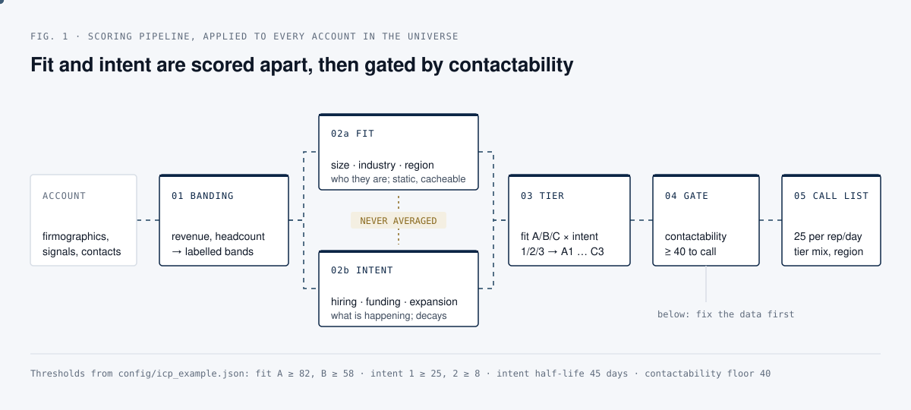
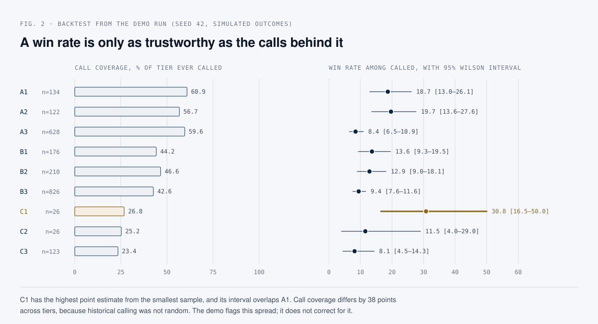

<p align="center">
  
</p>

<p align="center">
  <a href="https://github.com/darkanalytica1/icp-scoring-toolkit/actions/workflows/tests.yml"></a>
  
  
  
</p>

# ICP Scoring Toolkit

## What this is

A small, opinionated toolkit for turning a fuzzy "ideal customer profile" into an explicit, testable scoring model, with a reference implementation you can run end to end with zero setup. Fit and intent are scored on separate axes and never averaged, contactability is a gate rather than an input, the model itself lives in a reviewable JSON file, and the backtest reports how much of each tier was ever called next to its win rate.

Everything operates on **synthetic data only**. The 5,000-company universe is generated by a seeded random-number generator (`icp_toolkit/synth.py`) and contains no real company, contact or client information. Names, phone numbers, emails and domains are fabricated.

## Why it matters

Most homegrown ICP scoring lives in a spreadsheet with a column of weights and a single output number, and that number usually fails in one of three predictable ways:

1. **It blends things that should never be blended.** Averaging "this company is the right size and industry" with "this company is hiring right now" makes a stable, well-fitted, quiet account look identical to a poor-fit account reacting to something unrelated. Those accounts need completely different treatment, and a blended score erases the distinction.
2. **It trusts its own inputs.** A "domain verified" flag from an enrichment source, or a phone number that passes format validation, gets treated as ground truth. Neither is. A valid phone number can belong to an accountant rather than the company; a domain can be marked verified by an upstream process that never checked whether the company's name is on the page.
3. **It is never tested against what actually happened.** Weights are picked by intuition once and never revisited, and when someone finally backtests them, they forget that historical calling was never a random sample of the universe.

The toolkit is built against those three failure modes. The same discipline applies anywhere a ranked list drives scarce effort: keep "is this the right kind of target" apart from "is now the moment", distrust inputs you did not verify, and report the sample behind every rate.

## How it works

<p align="center">
  
</p>

Contactability is the gate between a tier and a call: an A1 account with no reachable contact is not a call, it is a research task. Tiers C2 and C3 never reach a call list because they have no share in the configured tier mix.

## Quick start

Requires Python 3.11 or later. The toolkit and demo use only the standard library; `pytest` is needed only for the tests.

```bash
git clone https://github.com/darkanalytica1/icp-scoring-toolkit
cd icp-scoring-toolkit
python3 -m venv .venv && source .venv/bin/activate
python -m icp_toolkit.demo          # full pipeline, prints every table below
pip install -r requirements.txt     # pytest, for the test suite
python -m pytest -q                 # 42 tests
```

No network access, no API keys. The demo is deterministic (seed 42): rerun it and you get identical numbers.

## Method

1. **Band, don't weight raw numbers.** Revenue and headcount are converted into a small number of labelled bands (`icp_toolkit/banding.py`) before anything else happens. Band boundaries are the thing worth arguing about, not decimal precision on a revenue figure that is six months stale.
2. **Score fit and intent separately.** Fit (`scoring.compute_fit_score`) answers "is this the kind of company we sell to": size, industry, geography. It is static and can be cached. Intent (`scoring.compute_intent_score`) answers "is something happening right now that makes this a good moment": hiring, funding, expansion, technology adoption. Signals decay with a 45-day half-life and must be recomputed often. **They are never averaged into one number.**
3. **Place every account on a fit × intent quadrant**, producing nine tiers, `A1` to `C3`, each with an explicit recommended action.
4. **Score contactability as its own axis and use it as a gate.** `quality.py` produces the evidence (shared-phone detection, re-verified domain checks, email plausibility, duplicates); `scoring.py` turns it into a contactability score; `territory.py` enforces the floor of 40 before an account can appear on a call list.
5. **Turn the ranked universe into workable daily call lists** with a per-rep cap, a deliberate tier mix and regional clustering (`territory.py`).
6. **Measure coverage and backtest honestly**, reporting the historical call coverage behind every tier's win rate (`evaluate.py`).

The model lives in [`config/icp_example.json`](config/icp_example.json) as **data, not code**. Every band boundary, weight, decay half-life and tier threshold is there, with `_comment` fields explaining the intent. A sales leader with no Python experience can read it, disagree with a number, change it and rerun the demo. A model only its author can inspect will not survive contact with the team that has to trust it.

### The fit × intent quadrant

Thresholds from `config/icp_example.json`: fit A ≥ 82, B ≥ 58; intent 1 ≥ 25, 2 ≥ 8.

| | **Intent 1** (strong, active signal) | **Intent 2** (moderate signal) | **Intent 3** (no signal) |
|---|---|---|---|
| **Fit A** (best fit) | **A1**: Call today. | **A2**: Nurture into a trigger event. | **A3**: Long-cycle nurture, not a cold-call target. |
| **Fit B** (workable) | **B1**: Worth a call despite imperfect fit. | **B2**: Standard pipeline. | **B3**: Low priority, marketing only. |
| **Fit C** (poor fit) | **C1**: Usually noise; verify before calling. | **C2**: Deprioritise. | **C3**: Suppress from active lists. |

Two cells are worth noticing. **C1 is not treated as a hot lead**: a poor-fit company showing an active signal is far more often a false positive (a signal that fired on the wrong entity, a company reacting to something unrelated to your product) than a genuine opportunity. **A3 is not a cold-call target** even though it is the best-fit segment: fit alone does not justify interrupting someone, timing does. That is the argument for two axes, made concrete.

### Output from the demo

Copied from `python -m icp_toolkit.demo` against the seeded 5,000-company synthetic universe (lightly abridged: separator lines and example IDs removed).

**Quadrant tier distribution**

```
tier  count  meaning
A1    220    Best-fit account, active buying signal now. Call today.
A2    215    Best-fit account, moderate signal. Nurture into a trigger event.
A3    1053   Best-fit account, no signal. Long-cycle nurture, not a cold call target.
B1    398    Workable fit, strong timing. Worth a call despite imperfect fit.
B2    451    Workable fit, moderate timing. Standard pipeline.
B3    1938   Workable fit, no timing. Low priority, marketing-only.
C1    97     Poor fit, active signal. Usually noise (wrong-size company reacting to something unrelated); verify before calling.
C2    103    Poor fit, moderate signal. Deprioritize.
C3    525    Poor fit, no signal. Suppress from active lists.
```

**Data-quality findings**

```
Shared phone numbers detected (used by >= 4 distinct companies): 6
Companies whose phone was flagged as shared (accountant / registered-office agent / call centre pattern): 396
  Worst offender: appears on 70 companies

Domain verification: never trust the declared flag, recheck it yourself.
  Declared 'verified' by source data: 3904
  Verified after rechecking homepage text ourselves: 3560
  Corrected FALSE (source said verified, name not actually on page): 712
  Recovered TRUE (source under-verified, name was actually there): 368

Duplicate company groups found by normalized-name matching: 261
```

Rechecking the declared flag moved 712 companies from "verified" to "not verified" and recovered 368 the source had wrongly marked unverified. Neither correction is visible if you only read the declared flag.

**Backtest against simulated historical outcomes**

```
tier  universe  called  coverage_%  wins  win_rate_%  confidence
A1    220       134     60.9        25    18.7        ok
A2    215       122     56.7        24    19.7        ok
A3    1053      628     59.6        53    8.4         ok
B1    398       176     44.2        24    13.6        ok
B2    451       210     46.6        27    12.9        ok
B3    1938      826     42.6        78    9.4         ok
C1    97        26      26.8        8     30.8        ok
C2    103       26      25.2        3     11.5        ok
C3    525       123     23.4        10    8.1         ok

Survivorship-bias warnings:
  - Call coverage varies by 38 points across tiers. Historical calling was not
    random, so comparing win rates across tiers directly overstates confidence
    in the ranking.
```

<p align="center">
  
</p>

Tier C1's apparent 30.8% win rate beats A1's 18.7%. Read at face value, the model's poorest-fit signal tier outperforms its top tier. It should not be read that way: C1's rate rests on 8 wins from 26 calls, and a 95% Wilson interval on that is roughly 16.5% to 50.0%, which overlaps A1's 13.0% to 26.1%. Note that the per-tier `confidence` column still says `ok` for C1, because 26 calls clears the module's minimum of 20 calls and 15% coverage; the only warning the demo raises is the 38-point coverage spread. The interval figures in the chart are computed here for illustration and are not produced by `evaluate.py`.

## Repository layout

```
icp_toolkit/
  synth.py       synthetic company-universe generator (deterministic, seeded)
  banding.py     revenue / headcount banding, industry grouping
  quality.py     shared-phone detection, domain re-verification, email plausibility, dedup
  scoring.py     fit score, intent score, contactability score, quadrant tiering
  territory.py   daily call-list construction (cap, tier mix, regional clustering)
  evaluate.py    coverage metrics and backtesting, including survivorship-bias reporting
  demo.py        end-to-end runnable demo
config/
  icp_example.json   the scoring model, as reviewable data
docs/
  METHOD.md          the reasoning behind each module
  ANTIPATTERNS.md    common ICP-scoring mistakes and how this toolkit avoids them
tests/
  pytest suite: banding boundaries, quality heuristics, scoring determinism, territory balance
```

## Limitations and assumptions

- **Synthetic data, simulated outcomes.** The universe and the call history are generated. The backtest demonstrates the reporting method, not evidence that these weights predict anything for a real business.
- **Illustrative weights.** The config describes a generic B2B seller of a mid-market software product. Tier thresholds were calibrated against the synthetic universe to give roughly 25/55/20 fit and 10/25/65 intent splits; recalibrate against your own data.
- **Survivorship bias is reported, not corrected.** There is no honest way to know the outcome for an account nobody called. `evaluate.py` shows the coverage behind each rate and warns on large spreads; it does not reweight or impute.
- **The confidence flag is a coarse floor** (at least 20 calls and 15% coverage). Tiers that clear it can still carry wide uncertainty, as C1 shows.
- **Domain verification is a heuristic**: "does the homepage text contain the normalised company name". It catches template pages and stale flags; it does not prove ownership.
- **Territory building is a simple, auditable allocation**, not an optimiser. Days tend to run in regional streaks; they are not guaranteed to be single-region.
- **No integrations.** No CRM, data vendor or network access.

## Further reading

- [`docs/METHOD.md`](docs/METHOD.md): the reasoning behind each module.
- [`docs/ANTIPATTERNS.md`](docs/ANTIPATTERNS.md): mistakes this design intentionally avoids.
- The interval in Fig. 2 is the Wilson score interval: E. B. Wilson, "Probable Inference, the Law of Succession, and Statistical Inference", *Journal of the American Statistical Association* 22 (158), 1927.

## License

MIT. See [LICENSE](LICENSE).
