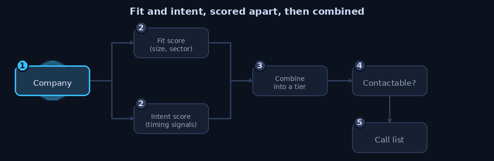

# ICP Scoring Toolkit

A small, opinionated toolkit for turning a fuzzy "ideal customer profile" into an explicit, testable scoring model, plus a working reference implementation you can run end to end with zero setup.

Everything in this repository operates on **synthetic data only**. The 5,000-company universe used in the demo is generated by a seeded random-number generator (`icp_toolkit/synth.py`), and it contains no real company, contact, or client information. Names, phone numbers, emails, and domains are all fabricated. Any resemblance to a real organization is coincidental.

```
python -m icp_toolkit.demo
```

No network access, no third-party dependencies, no API keys. Python 3.11+ and the standard library are enough.


## Fit and intent, never averaged

The core idea: a good-fit account you cannot act on and a poor-fit account
that is buying right now are different problems, and blending them into one
score hides both. Keep them on separate axes.

<p align="center">
  
</p>

Contactability is then a third gate: an A-tier account with no reachable
contact is not a call, it is a research task. The backtest reports coverage
next to win rate so the ranking is not flattered by survivorship bias.

## Why most ICP scoring is wrong

Most homegrown ICP scoring lives in a spreadsheet with a column of weights and a single output number. That number usually fails in one of three predictable ways:

1. **It blends things that should never be blended.** A spreadsheet that averages "this company is the right size and industry" with "this company is hiring right now" produces a score where a stable, well-fitted, quiet account looks identical to a poor-fit account that happens to be reacting to something unrelated. Those two accounts need completely different treatment, and a blended score erases the distinction that would tell you which is which.
2. **It trusts its own inputs.** A "domain verified" flag from an enrichment vendor, or a phone number that passes format validation, gets treated as ground truth. Neither is. A phone number can be perfectly valid and still belong to an accountant, not the company. A domain can be marked verified by an upstream process that never actually checked whether the company's name is on the page.
3. **It never gets tested against what actually happened.** Weights get picked by intuition once and never revisited, because nobody backtests them against closed-won data, and when someone finally does, they forget that historical calling was never a random sample of the universe.

This toolkit is built specifically against those three failure modes: fit and intent are kept on separate axes and never averaged, contactability is treated as an untrusted, re-verified gate rather than a trusted input, and the backtesting module reports the sampling bias in the historical data instead of hiding it.

## The method, in one page

1. **Band, don't weight raw numbers.** Revenue and headcount are converted into a small number of labeled bands (`icp_toolkit/banding.py`) before anything else happens. Band *boundaries* are the thing worth arguing about, not decimal precision on a revenue figure that is six months stale anyway.
2. **Score fit and intent separately.** Fit (`icp_toolkit/scoring.py::compute_fit_score`) answers "is this the kind of company we sell to": size, industry, geography. It is static and can be cached. Intent (`compute_intent_score`) answers "is something happening right now that makes this a good moment to reach out": hiring, funding, expansion, tech adoption. It decays over time and must be recomputed often. **They are never averaged into one number.**
3. **Place every account on a fit x intent quadrant**, producing nine tiers, `A1` through `C3`, each with an explicit recommended action.
4. **Score contactability as its own axis and use it as a gate**, not as an input to fit or intent. This includes shared-phone detection and re-verified domain checks (`icp_toolkit/quality.py`).
5. **Turn the ranked universe into workable daily call lists** with a per-rep cap, a deliberate tier mix, and geographic clustering (`icp_toolkit/territory.py`).
6. **Measure coverage and backtest honestly**, including reporting the historical calling bias that makes naive "win rate by tier" numbers untrustworthy for sparsely-called tiers (`icp_toolkit/evaluate.py`).

The scoring model itself lives in [`config/icp_example.json`](config/icp_example.json) as **data, not code**. A sales leader with no Python experience can open that file, read every weight and threshold, disagree with one, change it, and rerun the demo. That reviewability is a design goal, not an afterthought: a model nobody but its author can inspect will not survive contact with a sales team that has to trust it.

## The fit x intent quadrant

Fit tiers (A/B/C) and intent tiers (1/2/3) combine into nine tiers. This is the actual matrix produced by the demo, using the thresholds in `config/icp_example.json`:

| | **Intent 1** (strong, active signal) | **Intent 2** (moderate signal) | **Intent 3** (no signal) |
|---|---|---|---|
| **Fit A** (best-fit) | **A1**: Call today. Best-fit account, active buying signal now. | **A2**: Nurture into a trigger event. | **A3**: Long-cycle nurture, not a cold-call target. |
| **Fit B** (workable) | **B1**: Worth a call despite imperfect fit. | **B2**: Standard pipeline. | **B3**: Low priority, marketing-only. |
| **Fit C** (poor fit) | **C1**: Usually noise (wrong-size company reacting to something unrelated); verify before calling. | **C2**: Deprioritize. | **C3**: Suppress from active lists. |

Two things worth noticing in that table. First, **C1 is not treated as a hot lead**. A poor-fit company showing an active signal is far more often a false positive (a shared data-vendor glitch, a signal that fired on the wrong entity, a company reacting to something in its sector that has nothing to do with your product) than a genuine opportunity, and the model's own tier note says so. Second, **A3 is explicitly not a cold-call target**, even though it is your best-fit segment. Fit alone does not justify interrupting someone; timing does. That is the entire argument for keeping the two axes separate, made concrete.

## Real output from the demo

The tables below are copied from an actual run of `python -m icp_toolkit.demo` against the seeded 5,000-company synthetic universe (seed 42, fully deterministic, rerun it yourself and you will get identical numbers).

**Quadrant tier distribution:**

```
tier  count  meaning
--------------------------------------------------------------------------------------------------------------------------------
A1    220    Best-fit account, active buying signal now. Call today.
A2    215    Best-fit account, moderate signal. Nurture into a trigger event.
A3    1053   Best-fit account, no signal. Long-cycle nurture, not a cold call target.
B1    398    Workable fit, strong timing. Worth a call despite imperfect fit.
B2    451    Workable fit, moderate timing. Standard pipeline.
B3    1938   Workable fit, no timing. Low priority, marketing-only.
C1    97     Poor fit, active signal. Usually noise; verify before calling.
C2    103    Poor fit, moderate signal. Deprioritize.
C3    525    Poor fit, no signal. Suppress from active lists.
```

**Data-quality findings on the same 5,000-company universe:**

```
Shared phone numbers detected (used by >= 4 distinct companies): 6
Companies whose phone was flagged as shared (accountant / registered-office agent / call centre pattern): 396
  Worst offender: appears on 70 companies

Domain verification: never trust the declared flag, recheck it yourself.
  Declared 'verified' by source data: 3904
  Verified after rechecking homepage text ourselves: 3560
  Corrected FALSE (source said verified, name not actually on page): 712
  Recovered TRUE (source under-verified, name was actually there): 368

Duplicate company groups found by normalized-name matching: 261
```

Rechecking the domain-verification flag instead of trusting it moved 712 companies from "verified" to correctly "not verified," and separately recovered 368 companies the source data had wrongly marked as unverified. Neither correction is visible if you only look at the declared flag.

**Backtest against simulated historical outcomes, with call coverage reported alongside win rate:**

```
tier  universe  called  coverage_%  wins  win_rate_%  confidence
------------------------------------------------------------------
A1    220       134     60.9        25    18.7        ok
A2    215       122     56.7        24    19.7        ok
A3    1053      628     59.6        53    8.4         ok
B1    398       176     44.2        24    13.6        ok
B2    451       210     46.6        27    12.9        ok
B3    1938      826     42.6        78    9.4         ok
C1    97        26      26.8        8     30.8        ok
C2    103       26      25.2        3     11.5        ok
C3    525       123     23.4        10    8.1         ok

Survivorship-bias warnings:
  - Call coverage varies by 38 points across tiers. Historical calling was not
    random, so comparing win rates across tiers directly overstates confidence
    in the ranking.
```

Notice tier C1's apparent 30.8% win rate against A1's 18.7%. Taken at face value that looks like C1 (poor fit, active signal) outperforms the model's own top tier, which would be a strange result to act on. The confidence column and the coverage figures are exactly why this table also reports call coverage: C1 was called only 26 times out of a universe of 97, a small enough sample that this single number should not be read as "C1 beats A1." It is a reminder to look at sample size before trusting a win-rate ranking, not a claim about the true underlying rate.

## Repository layout

```
icp_toolkit/
  synth.py       synthetic company-universe generator (deterministic, seeded)
  banding.py     revenue / headcount banding, industry grouping
  quality.py     shared-phone detection, domain re-verification, email plausibility, dedup
  scoring.py     fit score, intent score, contactability score, quadrant tiering
  territory.py   daily call-list construction (cap, tier mix, geographic clustering)
  evaluate.py    coverage metrics and backtesting, including survivorship-bias reporting
  demo.py        end-to-end runnable demo, prints every table in this README
config/
  icp_example.json   the scoring model itself, as reviewable data
docs/
  METHOD.md          deeper writeup of the reasoning behind each module
  ANTIPATTERNS.md    common ICP-scoring mistakes and how this toolkit avoids them
tests/
  pytest suite covering banding boundaries, quality heuristics, scoring determinism,
  and territory balance
```

## Quick start

```bash
git clone <this repo>
cd icp-scoring-toolkit
python -m icp_toolkit.demo      # runs the full pipeline, no dependencies needed
pip install -r requirements.txt # only needed to run the test suite
pytest -q
```

## The config file is the model

Open [`config/icp_example.json`](config/icp_example.json). Every band boundary, every weight, every recency-decay half-life, and every tier threshold lives there, with inline `_comment` fields explaining the intent behind each section. Changing the model means editing that file, not the Python. This is deliberate: a scoring model that only its engineer can read will not get adopted by the sales team that has to act on it.

## What this toolkit does not do

It does not connect to a CRM, a data vendor, or the internet. It does not include any real firmographic, contact, or outcome data. It does not claim its illustrative weights are correct for any real business; they are a worked example meant to be replaced with your own. See [`docs/ANTIPATTERNS.md`](docs/ANTIPATTERNS.md) for a longer list of mistakes this design intentionally avoids, and [`docs/METHOD.md`](docs/METHOD.md) for the reasoning behind each module.

## License

MIT. See [LICENSE](LICENSE).
